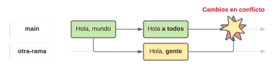
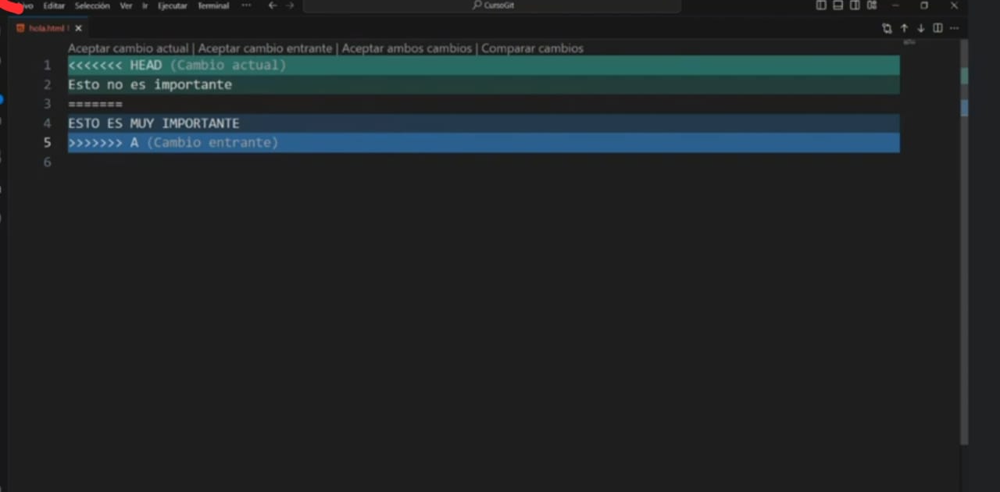
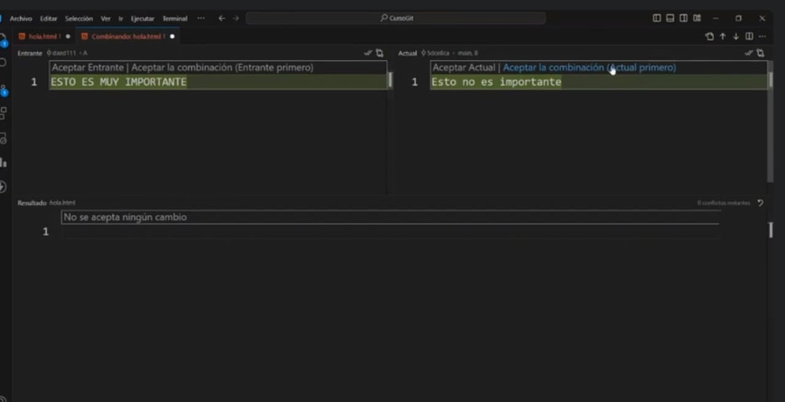

# **CURSO GIT**
# CLASE 1
## 1.- INTRODUCCION A GIT
### ¿Que es un control de versiones?
Es un sistema que registra cada cambio que se realiza en el codigo fuente de un proyecto.
### ¿Porque es importante?
* Por el rendimiento
* Seguridad
* Flexibilidad
#### ¿Historia?
* 1990-------el primer control de versiones
* 2005-------Creacion de Git
* 2008-------Creacion de GitHub
* 2018-------Microsoft compra GitHub
* 2024-------git domina el mercado
### ¿Que es un Repositorio?
Es una carpeta en la que se almacenan las diferentes versiones de los ficheros de un proyecto y el historio de los cambios que se ham realizado 
Los repositorios pueden ser:
* Locales = Lo tenemos en nuestro ordenador
* Remotos = Ubicados en un servidor externo
## 2.- COMO INICIAR UN PROYECTO EN GIT
### Un comando util para ver el uso de git 
> [git init --help](https://git-scm.com/docs/git-init)
### Como inicicializar un proyecto en git
> git init
## los tres estados de git
* Modifed = El archivo ha sido creado, eliminado o contiene cambios"COLOR VERDE"
* staged = El archivo esta en preparacio para ser confirmado""
* Commited = El archivo esta grabado en el repositorio local
 ## Comandos de Git
 * git status 
 > Para ver el estado en que esta git 
 * git add <texo.html>
 > Para crear un archivo 
 * git reset HEAD <nombre_del_archivo>
 > Para sacar un archivo específico del área de staging
 * git reset HEAD <nombre_del_archivo_1> <nombre_del_archivo_2> ... <nombre_del_archivo_n>
 > Para sacar varios archivos del área de staging 
 * git log
 > Permite ver el historial de commit que realizamos
## 3.- COMO HACER UN COMMIT
* git commit -m 
> el mensaje especificado se usara como titulo del commit para describir los cambios realizados.
## Que es un HEAD?
Es un puntero que referencia el punto actual del historial de cambios del repositorio en el que estas trabajando.
# CLASE 2 
### Que es una RAMA?
En Git, una rama (o "branch") es una versión paralela del repositorio que permite trabajar de manera independiente en diferentes partes de un proyecto sin afectar la línea principal de desarrollo.
## Para que sirven las ramas?
Permite realizar un desarrollo paralelo.
## Como crear una rama
* git branch
> listar a todas las ramas
* git branch <nombredelarama>
> para crear una rama
* git switch <nombredelarama> 
> para cambiar de rama
* git checkout 
> otra foma de cambiar la rama
* git checkout -b <nombredelarama>
> creamos la rama y nos cambiamos de rama
## Fusionar ramas
Las bifurcasiones de codigo que hemos creado en forma de ramas tendran dos destinos: acabar en el olvido para no terminar en ningun lado o ser fusionadas en otra ram
* git merge <nombredelarama>
> comando para fusionar ramas 
## Eliminar ramas porque?
Para mantener limpio el espacio de trabajo 
*git branch -d <nombredelarama>
> Comando para eliminar una rama
* git branch
>
* git branch -a
>
* git log --online
> Solo muestra el titulo de los commits
## Conflictos de git
# Que pasa su queremos fusionar dos ramas, la de destino ha realizado cambios en las mismas lineas de un fichero que los que queremos fusionar?

Al resolver un conflicto debemos decidir en:
> Nos quedamos con los cambios de la rama main
> Nos quedamos con los cambios que vienen de la rama changes
> Modificamos los cambios para hacer una fusion personalizada
## Cuando ocurra un conficto <hacemos click en la opcion de RESOLVER EN EL EDITOR DE CONVINACION>
>HAY UN CONFLICTO

>HACEMOS CLICK EN LA OPCION "RESOLVER EN EL EDITOR DE CONVINACION"

