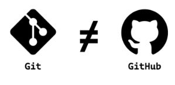
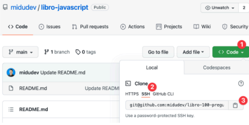
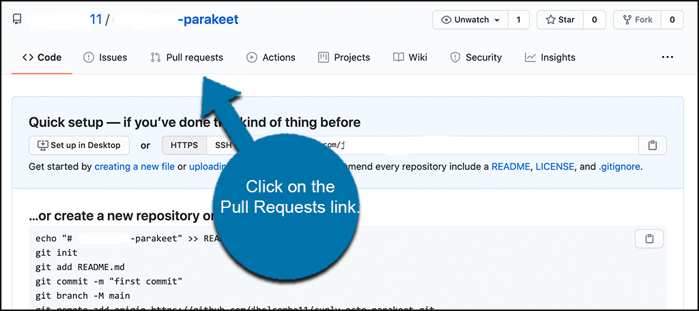
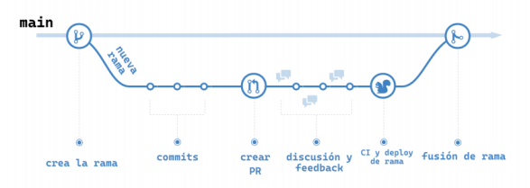
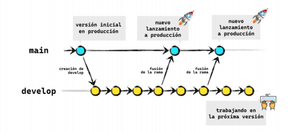
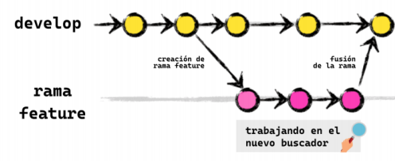
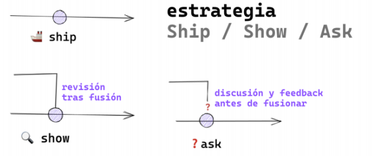
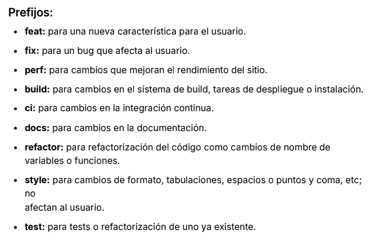
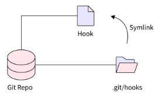
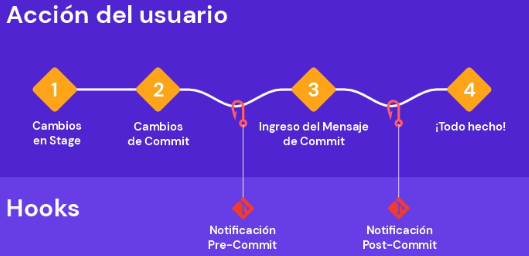

# **CURSO GIT**
# CLASE 1
## 1.- INTRODUCCION A GIT
### ¿Que es un control de versiones?
Es un sistema que registra cada cambio que se realiza en el codigo fuente de un proyecto.
### ¿Porque es importante?
* Por el rendimiento
* Seguridad
* Flexibilidad
#### ¿Historia?
* 1990-------el primer control de versiones
* 2005-------Creacion de Git
* 2008-------Creacion de GitHub
* 2018-------Microsoft compra GitHub
* 2024-------git domina el mercado
### ¿Que es un Repositorio?
Es una carpeta en la que se almacenan las diferentes versiones de los ficheros de un proyecto y el historio de los cambios que se ham realizado 
Los repositorios pueden ser:
* Locales = Lo tenemos en nuestro ordenador
* Remotos = Ubicados en un servidor externo
## 2.- COMO INICIAR UN PROYECTO EN GIT
### Un comando util para ver el uso de git 
> [git init --help](https://git-scm.com/docs/git-init)
### Como inicicializar un proyecto en git
> git init
## los tres estados de git
* Modifed = El archivo ha sido creado, eliminado o contiene cambios"COLOR VERDE"
* staged = El archivo esta en preparacio para ser confirmado""
* Commited = El archivo esta grabado en el repositorio local
 ## Comandos de Git
 * git status 
 > Para ver el estado en que esta git 
 * git add <texo.html>
 > Para crear un archivo 
 * git reset HEAD <nombre_del_archivo>
 > Para sacar un archivo específico del área de staging
 * git reset HEAD <nombre_del_archivo_1> <nombre_del_archivo_2> ... <nombre_del_archivo_n>
 > Para sacar varios archivos del área de staging 
 * git log
 > Permite ver el historial de commit que realizamos
## 3.- COMO HACER UN COMMIT
* git commit -m 
> el mensaje especificado se usara como titulo del commit para describir los cambios realizados.
## Que es un HEAD?
Es un puntero que referencia el punto actual del historial de cambios del repositorio en el que estas trabajando.
# CLASE 2 
### Que es una RAMA?
En Git, una rama (o "branch") es una versión paralela del repositorio que permite trabajar de manera independiente en diferentes partes de un proyecto sin afectar la línea principal de desarrollo.
## Para que sirven las ramas?
Permite realizar un desarrollo paralelo.
## Como crear una rama
* git branch
> listar a todas las ramas
* git branch <nombredelarama>
> para crear una rama
* git switch <nombredelarama> 
> para cambiar de rama
* git checkout 
> otra foma de cambiar la rama
* git checkout -b <nombredelarama>
> creamos la rama y nos cambiamos de rama
## Fusionar ramas
Las bifurcasiones de codigo que hemos creado en forma de ramas tendran dos destinos: acabar en el olvido para no terminar en ningun lado o ser fusionadas en otra ram
* git merge <nombredelarama>
> comando para fusionar ramas 
## Eliminar ramas porque?
Para mantener limpio el espacio de trabajo 
*git branch -d <nombredelarama>
> Comando para eliminar una rama
* git branch
>
* git branch -a
>
* git log --online
> Solo muestra el titulo de los commits
## Conflictos de git
# Que pasa su queremos fusionar dos ramas, la de destino ha realizado cambios en las mismas lineas de un fichero que los que queremos fusionar?

Al resolver un conflicto debemos decidir en:
* Nos quedamos con los cambios de la rama main
* Nos quedamos con los cambios que vienen de la rama changes
* Modificamos los cambios para hacer una fusion personalizada
## Cuando ocurra un conficto
* Hacemos Click En La Opcion De Resover En El Editor De Convinacion
# CLASE 3
## Git y GItHub son lo mismo ?
* Git: Herramienta de control de versiones.
* GitHub: Plataforma en línea para alojar y gestionar repositorios de Git.

## Que es un repositorio remoto?
Son remotos porque estan hospedados en un servidor
## Clonado de un repositorio remoto 
Para el clonado de un repositorio necesitamos saber la direccion HTTPS o SSH 

* Ahora clonamos clonamos al repositorio remoto con :
> git clone PegamosLaDireccionDeLaImgen
 ## Como enlazar un repositorio local con un repositorio remoto?
 Para conectar al repositorio local con el repositorioo remoto debemos usar el comando 
 > git remote add 
 ## Error del push
Es comun que ocurra cuando no tenemos cambios que han ocurrido en el repositorio remoto. Y para esto usariamos el parametro
> -f 
* Para forzar el push y saltar este error. Este es en caso de que NO SABEMOS el tipo de error que tenemos "por lo cual no es conveniente"
# CLASE 4
## Que difenrencia hay entre git push y git pull?
* git push : Nos sirve para empujar cualquier cambio
* git pull : Se emplea para extraer y descargar contenido desde un repositorio remoto
### Que hace el git push -u?
> git push -u
* Establece una relación de seguimiento entre la rama local y la rama remota
### Que hace el git push -f?
> git push -f
* Fuerza el push, sobrescribiendo la historia de la rama remota con la historia de la rama local.
### Borrar las ramas remotas
> git push origin --delete <nombre_de_la_rama>
* Para borrar ramas remotas
> git push origin rama_origen:rama_destino
* Esto envía la rama_origen al repositorio remoto como rama_destino.
> git pull origin login
* Descarga los cambios desde la rama login del repositorio remoto (origin) y los fusiona automáticamente con la rama local en la que te encuentras actualmente.
> git pull--set-upstream origin <rama>
* Establece una relación de seguimiento entre la rama local actual y una rama remota específica
> git pull origin<rama1><rama2><ramaN>
* Actualiza la rama local actual con los cambios de una o varias ramas remotas específicas
## Que es una Pull Request?
* Es una peticion de cambios que se envia al repositorio original, tambien conocida como PR
## Como se hace una PR 
Primero tenemo que subir nuestra rama con git push y a configuraciones hay 2 maneras:
* la rama que subimos recientemente y te aparece la opcion en GitHub>Code
* Irnos al apartado Pull Request

## Como hacer un buen PR
* ENFOCA TU CODIGO EN UNA SOLA CONSOLA
* EXPLICA TU PULL REQUEST 
# CLASE 5
## Git FLow 

* Se basa en la creación de Pull Requests que serán discutidas para que se integren en la rama principal que siempre está actualizada con los cambios más recientes y preparada
para ser desplegada.
* Organiza las ramas en dos tipos: permanentes (para versiones estables y desarrollo) y temporales (para características nuevas y correcciones).
### Ramas Permanentes:

#### master:
 Representa la versión estable y lista para producción del software.
#### develop:
Es la rama principal de desarrollo donde se integran todas las características nuevas.
### Ramas Temporales:

#### feature:
 Ramas creadas para implementar nuevas características. Se ramifican desde develop y se fusionan nuevamente en develop una vez completadas.
#### release:
 Ramas creadas para la preparación de una nueva versión para producción. Se ramifican desde develop y se fusionan tanto en develop como en master una vez que la versión está lista.
#### hotfix:
 Ramas creadas para corregir errores críticos en producción. Se ramifican desde master, se solucionan los problemas y luego se fusionan tanto en master como en develop.

## Trunk Based Development
> Es una estrategia que se basa en que el mayor tiempo de desarrollo se concentra en una sola rama llamada trunk (tronco) que normalmente corresponderá con main.
#### Beneficios de Trunk Based Development
* Integración continua y menos fricción
* Menos trabajo manual
* Despliegue a producción continuo
## Ship / Show / Ask
*  Es una estrategia de ramas que combina la idea de crear Pull Request con la habilidad de seguir publicando cambios rápidamente.

* Ship:
Se fusiona en la rama principal sin revisión.
* Show:
Abre una petición de cambios para que sean revisados por CI pero se fusiona inmediatamente.
* Ask:
Abre una PR para discutir los cambios antes de fusionarlos.
# CLASE 6
## BUENAS PRACTICAS EN GIT
### ¿Cada cuánto debería hacer un commit?
> Es mejor hacer commits pequeños, agrupando pequeñas mejoras o acciones, que un commit con todo lo que se quiere hacer es decir hacer commit muy amenudo.
### Escribir buenos commits
#### 1. Usar el verbo imperativo (Add, Change, Fix, Remove)
* Add: Significa que se añade un nuevo archivo.
* Change: Significa que se modifica un archivo existente.
* Fix: Significa que se arregla un bug.
* Remove: Significa que se elimina un archivo existente.
#### 2. No uses punto final ni puntos suspensivos en tus mensajes
* Usar puntuación, más allá de las comas, es innecesario a la hora de crear un buen mensaje de commit.
#### 3. Usa como máximo 50 caracteres para tu mensaje de commit
* Sé corto y conciso. Si tienes mucho que explicar es probable que tu commit contenga demasiados cambios.
#### 4. Añade todo el contexto que se necesario en el cuerpo del commit
* A veces necesitas proveer de más contexto a tu commit.
#### 5. Usa un prefijo para tus commits para hacerlos más semánticos

#### 6. Considera usar utilidades para hacer commit
* Podemos utilizar Husky es una herramienta que te permite usar hooks de Git para ejecutar scripts o comandos automáticamente en ciertas acciones del repositorio, como hacer commit o push
> Que es mejor ejecutarlas antes de hacer un push
### Escribir un buen nombre de rama
#### Usa el nombre de la acción que se realiza en la rama
* bug: Cambios de código para arreglar un bug conocido.

* feature: Desarrollo de una nueva característica.

* experiment: Experimentos que nunca serán fusionados.

* hotfix: Cambio rápido de un error crítico.
#### Usar los IDs de JIRA o el sistema de tickets que 
Una buena idea es adjuntar al principio del nombre de la rama la ID del ticket o de la issue que esté asociada.
### ¿Debería alterar el historial de mi proyecto?
* Es mejor idea reiniciar la contraseña o la llave. ¿Por qué?
> Porque?
* Esa información ya es vulnerable al haber sido expuesta y
borrarla del historial no garantiza nada.
# CLASE 7
## ¿Cómo deshacer mis cambios?
* Dejo de funcionar el proyecto 
* Queremos recuperar una parte del codigo que eliminamos
* Queremos recuperar archivos eliminamos
### Comandos destructivos y no destructivos
Los comandos destructivos afectan el historial de commits realizado, sin embargo los comandos no destructivos trabajan en base al historial sin afectarlo
> si queremos mantener los cambios
* git reset -- soft HEAD~1
Con este comando hacemos que la rama actual retroceda a la revision que le indicamos 
> si no queremos mantener los cambios 
*  git reset --hard HEAD~1
Esto eliminara los cambios de los que habiamos hecho commit anteriormente<ojo> Asegurate que eso es lo que quieres hacerlo.
> arreglar el ultimo commit --amend -m "mensaje que quieres"
* QUieres anadir mas cambios al ultimo commit 
## Comandos para deshacer cambios 
> git reset --hard HEAD~<N>
* Mueve la rama actual a N commits atrás y elimina los cambios en el área de trabajo y el índice
> git reset --hard<SHA>
* Mueve la rama actual al commit identificado por <SHA> y elimina los cambios en el área de trabajo y el índice
>git revert HEAD~<N>
* Genera un nuevo commit que revierte los cambios del commit HEAD~<N>.
>git checkout HEAD~<N>
* Cambia la rama actual a HEAD~<N> en modo detached HEAD, sin mover la rama actual.
>git reset --soft HEAD~<N>
* Mueve la rama actual a N commits atrás pero mantiene los cambios en el índice y el área de trabajo.
>git reset --soft <SHA>
* Mueve la rama actual al commit identificado por <SHA> pero mantiene los cambios en el índice y el área de trabajo.
>git revert<SHA>
* Genera un nuevo commit que revierte los cambios del commit identificado por <SHA>.
>git checkout<SHA>
* Cambia la rama actual al commit identificado por <SHA> en modo detached HEAD, sin mover la rama actual.
# CLASE 8
## ¿Qué es un Hook?

* Tambien conocido como punto de enganche, es la posibilidad de ejecutar una accion o script cada vez que ocurre un evento determinado de Git
### Hooks del lado del cliente (Repositorio local)
> Sólo afectan al repositorio local que los contiene. Esto significa que puedes tener el mismo repositorio clonado de forma local varias veces y, sin embargo, ejecutar diferentes hooks.
* pre-commit: 
>Ejecuta acciones antes de hacer commit, como linting de archivos modificados.
* prepare-commit-msg:
> Modifica el mensaje del commit antes de que el usuario lo vea.
* commit-msg: 
>Verifica el mensaje del commit, asegurándose de que siga una convención específica.
* post-commit: 
>Se usa para notificaciones, como enviar un mensaje a Slack después de un commit.
* pre-push: 
>Ejecuta tests antes de hacer push para evitar subir cambios que no pasen las pruebas.
* post-checkout y post-merge: 
>Limpian el directorio de trabajo después de un checkout o merge, eliminando ramas no utilizadas.
## EJEMPLO DE UN HOOKS

## HOOKS del lado del servidor
* pre-receive: 
> Verifica los commits antes de guardarlos, comprobando permisos y evitando conflictos.
* update:
>Similar a pre-receive, pero permite control granular sobre qué referencias pueden ser actualizadas.
*post-receive: 
>Notifica a los usuarios sobre nuevos cambios, como enviar correos o actualizar una interfaz de usuario.
## GitHub Actions
* Es una plataforma de automatización integrada en GitHub que permite definir y ejecutar flujos de trabajo para construir, probar y desplegar tu código directamente desde tu repositorio
### Características Principales
* AUTOMATIZACION 
* CI/CD
* INTEGRACION CON GitHub
## Que es una Alias ?
* Los alias permite definir una serie de comandos que pueden ser usados en lugar de los nombres completos 
> git co........git commit
> git st........git status

